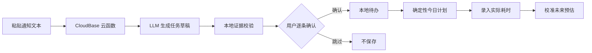

# PlanProof · 证据驱动的 AI 任务规划小程序

> 将课程通知、作业要求与会议纪要变成**可验证、可确认、可执行**的任务计划。

[查看 V2.0.0 Release](https://github.com/hi-jingjie/Todolist/releases/tag/v2.0.0) · [查看 V1.0.0 Release](https://github.com/hi-jingjie/Todolist/releases/tag/v1.0.0)

## 为什么做这个项目

大学生常常从群公告、课程通知和活动消息里看到任务：截止日期、提交材料和优先级混在一段文字中。普通待办工具需要手动录入；普通 AI 提取又可能编造截止日期或直接把错误任务写进清单。

PlanProof 的目标不是“让模型替用户做决定”，而是把 AI 变成一个可检查的任务助手：模型生成候选任务，应用验证每条候选任务的原文依据，用户逐条确认后才保存。

## 核心流程



## 它和普通 AI 待办有什么不同

### 1. AI 输出必须有原文证据

每个 AI 草稿都必须携带 `evidenceQuote`。应用会验证它是否是用户输入中的非空连续片段；任何编造的依据、无效日期、优先级或时长都会被拦截，不能进入确认界面。

### 2. AI 不会自动写入用户任务

模型只返回不可信的候选草稿。用户能看到标题、截止日期、预计时长、置信度、不确定项和原文依据，并且只能逐条确认保存。

### 3. 任务排程是确定性的

“今日计划”不交给模型拍脑袋决定。它固定按以下顺序排序：逾期任务 → 截止日期 → 优先级 → 创建顺序；在 60 / 120 / 180 分钟容量内安排任务，其余任务明确展示为未排入项。

### 4. 真实耗时会反馈到下一次计划

用户可以保存实际耗时。系统只使用已完成任务的“实际耗时 / 预估时长”计算校准系数，并将它限制在 50% 到 200% 之间，避免极端数据影响后续计划。

## 技术架构

| 层级 | 方案 | 职责 |
| --- | --- | --- |
| 客户端 | 微信小程序原生框架 | 文本输入、证据展示、人工确认、任务与计划界面 |
| 任务数据 | `wx.setStorageSync` | 本地保存待办、原文依据、预估与实际耗时 |
| AI 边界 | 腾讯云 CloudBase 云函数 | 保管模型密钥，调用 OpenAI 兼容接口 |
| 模型服务 | 通义千问百炼 / OpenAI 兼容 API | 生成结构化任务草稿 |
| 质量保障 | Node.js 内置断言 + 评测样例 | 验证证据校验、保存、排程和完整工作流 |

云函数只从环境变量读取 `MODEL_API_URL`、`MODEL_API_KEY` 和 `MODEL_NAME`；API Key 不进入小程序客户端，也不会提交到 Git。

## 功能清单

- AI 文本导入：输入课程通知、作业要求或会议纪要，生成候选任务。
- 证据校验：拒绝没有原文依据的模型输出。
- 人工确认：一次只保存用户确认的一条任务。
- 每日计划：按可投入时间安排任务，并展示未排入项。
- 耗时校准：用实际完成时长修正下一次任务预估。
- V1 基础能力：分类、筛选、重复任务、专注计时、统计与归档。

## 版本演进

| 版本 | 定位 | 代表能力 |
| --- | --- | --- |
| [V1.0.0](https://github.com/hi-jingjie/Todolist/releases/tag/v1.0.0) | 本地优先的待办工具 | 分类、筛选、专注、统计、归档 |
| [V2.0.0](https://github.com/hi-jingjie/Todolist/releases/tag/v2.0.0) | PlanProof AI 任务规划 | 云函数密钥边界、证据校验、人工确认、每日计划、耗时反馈 |

## 本地运行

1. 使用微信开发者工具导入本仓库根目录。
2. 配置自己的正式小程序 AppID；测试号不能开通云开发。
3. 在“云开发”中开通环境，并将 `cloudfunctions` 根目录绑定到该环境。
4. 右键 `cloudfunctions/task-extractor`，选择“上传并部署：云端安装依赖”。
5. 在云函数配置中设置：

```text
MODEL_API_URL=https://dashscope.aliyuncs.com/compatible-mode/v1/chat/completions
MODEL_API_KEY=<你的模型 API Key>
MODEL_NAME=qwen-plus
```

6. 编译小程序，从首页进入“AI 导入任务”或“今日计划”。

> `MODEL_API_KEY` 只应配置在云函数环境变量中。不要将它提交到仓库、写进前端代码或发送给他人。

## 自动测试与评测

项目不依赖额外测试框架，使用 Node.js 内置断言：

```powershell
Get-ChildItem tests\*.test.js |
  Sort-Object Name |
  ForEach-Object { node $_.FullName }
```

`evals/notification-fixtures.js` 包含匿名评测样例，覆盖：明确截止日、未知截止日、多任务通知和虚构证据拒绝。

## 目录结构

```text
pages/ingest/                 AI 文本导入与逐条确认
pages/plan/                   今日计划与实际耗时反馈
cloudfunctions/task-extractor 模型调用与密钥边界
utils/plan-proof/             校验、映射、排程、校准与页面状态
evals/                        任务提取评测样例
tests/                        单元测试与端到端工作流测试
```

## 数据与隐私

待办、分类、原文依据与专注记录保存在当前设备的小程序本地存储中。清理小程序数据、清理微信缓存或更换设备后，数据不会自动同步恢复。正式发布前，请按微信公众平台要求补充隐私指引与服务类目。
